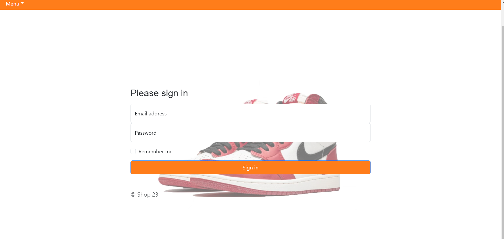
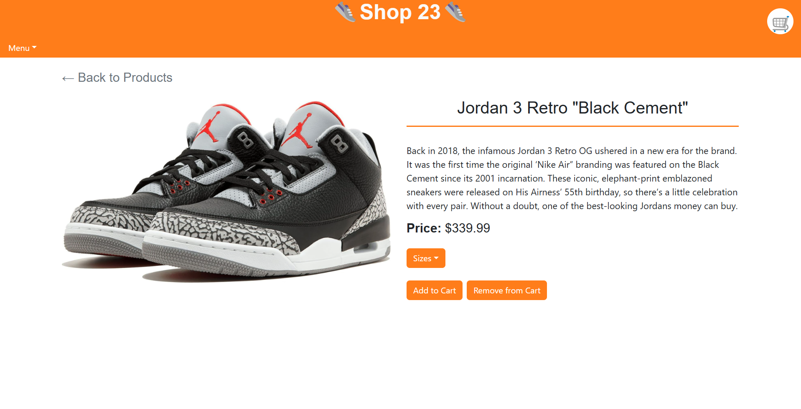
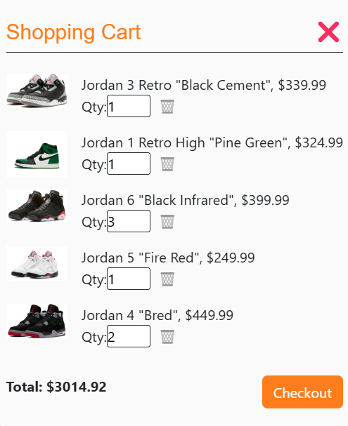

# Project 3: Shop 23

## Description

For this project, our team developed a fully functional e-commerce web application specializing in the sale of Jordan-brand sneakers for men, women, and children. The application provides a seamless shopping experience, allowing users to browse a curated selection of shoes, add items to their cart, adjust quantities, remove products, and proceed to checkout. To complete a purchase, users must have an account and be signed in, ensuring a secure transaction process. This project showcases our ability to design and implement a user-friendly and efficient online shopping platform.

## Table of Contents

- [Installation](#installation)
- [Usage](#usage)
- [Credits](#credits)
- [License](#license)

## Installation

Use "npm i" to download the Mongoose, Express, React, Jwt-decode, GraphQL, Stripe, Apollo/server and /client libraries.

## Usage

<a href="">Deployed Link</a> 

First login with your email and password or create an account by signing up.

On the homepage, you can explore a variety of shoe selections and either add your preferred pair to the cart or click on a product to view its detailed information.

On the details page, you can view the shoe's description and choose your desired size.

In the cart, you can adjust the quantity of the shoes you wish to purchase or remove them entirely.

The Order History page displays a record of all the shoes you have previously purchased.

## Credits

<a href="https://coding-boot-camp.github.io/full-stack/render/deploy-mern-stack-with-render-guide">Deploying a MERN Stack Application to Render</a> 

<a href="https://gist.github.com/lukas-h/2a5d00690736b4c3a7ba">License Page</a> 

## License

